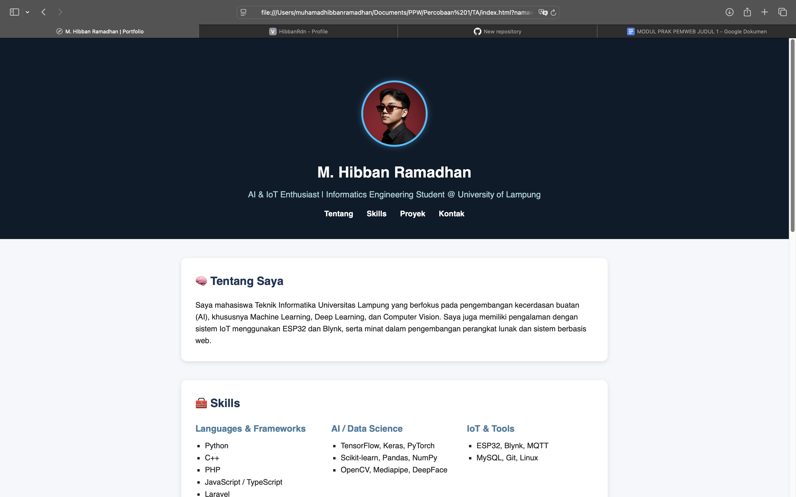

# 🖥️ Praktikum Pemrograman Web

Repositori ini berisi kumpulan tugas, laporan, dan proyek praktikum mata kuliah **Pemrograman Web**.  
Setiap folder mewakili modul atau tugas tertentu yang dikerjakan selama semester berjalan.

---

## 📁 Struktur Folder

```
PraktikumPemWeb/
├── TA_Modul 1/
│   ├── index.html
│   ├── style.css
│   └── Screenshot Tampilan
├── TA_Modul 2/
│   ├── index.html
│   ├── style.css
│   ├── Screenshot Tampilan
│   └── README.md
├── (folder modul lainnya)
└── README.md
```
---
## 🧠 Deskripsi Singkat: TA_Modul 2
**Judul Modul**: HTML dan CSS
**Tujuan**:
Memahami struktur dasar pembuatan halaman web menggunakan HTML dan CSS, serta mengenali hubungan antara elemen HTML dengan gaya tampilan yang diatur melalui file CSS eksternal.
### Mahasiswa diharapkan mampu:
- Menggunakan elemen HTML untuk membangun struktur halaman web.
- Mengaplikasikan CSS eksternal dalam mengatur tampilan dan layout halaman.
- Menerapkan konsep desain UI yang konsisten dan estetis.
- Menggunakan Git untuk manajemen versi proyek web.
### Teknologi yang Digunakan:
- HTML5
- CSS3
### Output:
Sebuah website portfolio pribadi dengan komponen utama:
- Header berisi nama dan deskripsi.
- Navigasi menampilkan identitas mahasiswa (NPM, kelas, dan kontak WhatsApp).
- Konten utama berisi foto mahasiswa.
- Footer menampilkan alamat tempat tinggal.

---
##  ⚙️ Cara Menjalankan
### 1. Clone repositori ini:
```
git clone https://github.com/HibbanRdn/PraktikumPemWeb.git
```
### 2. Masuk ke folder repo:
```
cd PraktikumPemWeb/TA_Modul\ 2
```
### 3. Buka file index.html menggunakan browser atau dengan ekstensi **Live Server** di VSCode.
---
## 📸 Preview Tampilan Website
Berikut adalah tampilan hasil akhir dari website portfolio yang dibuat pada modul ini:

<p align="center">
  
</p>

Atau pratinjau langsung di browser setelah menjalankan file index.html.
---
## 👨‍💻 Dibuat Oleh
- Nama: Muhamad Hibban Ramadhan
- NPM: 2315061094
- Program Studi: Teknik Informatika
- Kelas: PPW-E
- Mata Kuliah: Praktikum Pemrograman Web


