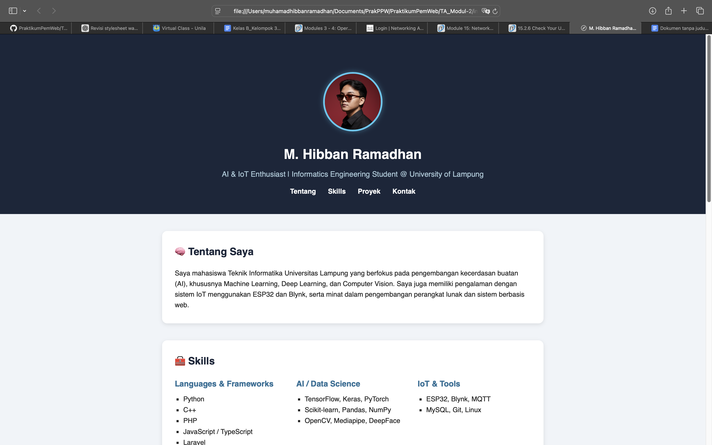
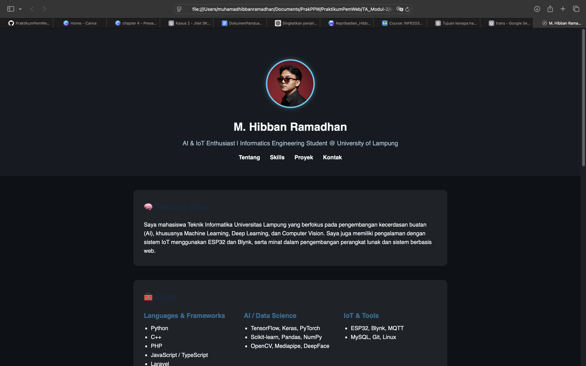

# 🖥️ Praktikum Pemrograman Web

Repositori ini berisi kumpulan tugas, laporan, dan proyek praktikum mata kuliah **Pemrograman Web**.  
Setiap folder mewakili modul atau tugas tertentu yang dikerjakan selama semester berjalan.

---

## 📁 Struktur Folder

```
PraktikumPemWeb/
├── TA_Modul 1/
│   ├── index.html
│   ├── style.css
│   └── Screenshot Tampilan
├── TA_Modul 2/
│   ├── index.html
│   ├── style.css
│   ├── Screenshot Tampilan
│   └── README.md
├── (folder modul lainnya)
└── README.md
```
---
## 🧠 Deskripsi Singkat: TA_Modul 2
**Judul Modul**: Git & Version Control
**Tujuan**:
Memahami konsep dasar sistem **version control** menggunakan Git, serta menguasai langkah-langkah dasar dalam mengelola proyek web melalui repositori lokal dan repositori daring (GitHub).
### Mahasiswa diharapkan mampu:
- Menginisialisasi repository Git lokal menggunakan perintah **git init**.
- Melakukan tracking dan commit perubahan dengan **git add** dan **git commit**.
- Menghubungkan repository lokal ke GitHub menggunakan **git remote**.
- Mengunggah proyek ke GitHub menggunakan **git push**.
- Mengelola versi kode dengan **branching**, **merging**, dan **pull request**.
### Teknologi yang Digunakan:
- HTML5
- CSS3
- Git & GitHub
### Output:
Sebuah repositori Git yang berisi:
- Struktur folder proyek web terkelola.
- Riwayat commit yang terdokumentasi dengan baik.
- Branch tambahan untuk eksperimen styling atau fitur baru.
- Proyek berhasil di-push ke GitHub publik.

---
##  ⚙️ Cara Menjalankan
### 1. Clone repositori ini:
```
git clone https://github.com/HibbanRdn/PraktikumPemWeb.git
```
### 2. Masuk ke folder repo:
```
cd PraktikumPemWeb/TA_Modul\ 2
```
### 3. Buka file index.html menggunakan browser atau dengan ekstensi **Live Server** di VSCode.
---
## 📸 Preview Tampilan Website
Berikut adalah tampilan hasil akhir dari website portfolio yang dibuat pada modul ini:

#### ⚠️ Sebelum Merge Branch Style
<p align="center">
  
</p>
Hasil: Masih sama seperti tampilan di [TA_Modul-1](./TA_Modul-1).

#### ⚠️ Setelah Merge Branch Style
<p align="center">
  
</p>
Hasil: Penambahan warna pada style.

Atau pratinjau langsung di browser setelah menjalankan file index.html.
---
## 👨‍💻 Dibuat Oleh
- Nama: Muhamad Hibban Ramadhan
- NPM: 2315061094
- Program Studi: Teknik Informatika
- Kelas: PPW-E
- Mata Kuliah: Praktikum Pemrograman Web


