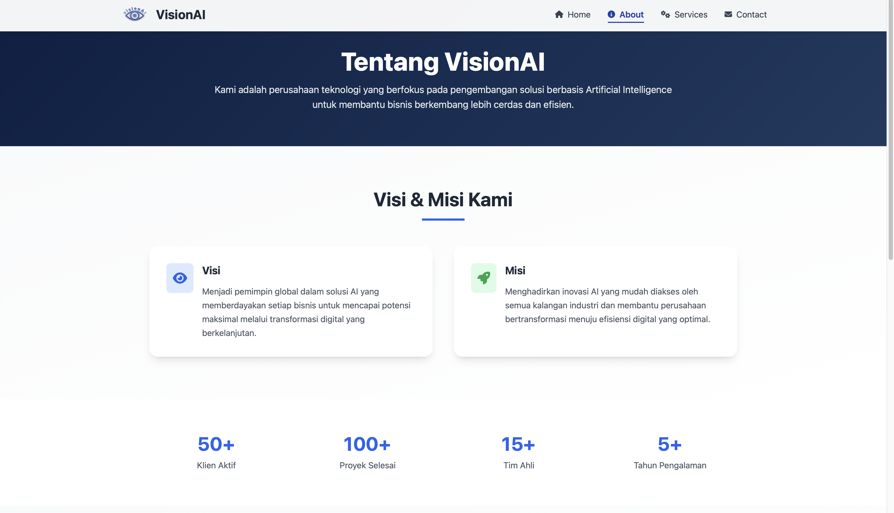
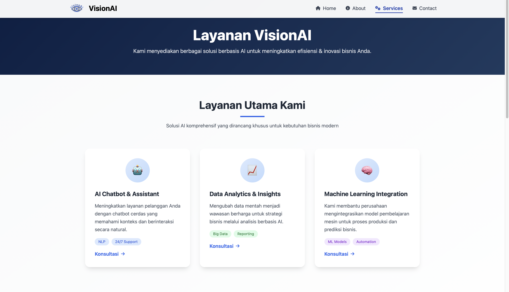
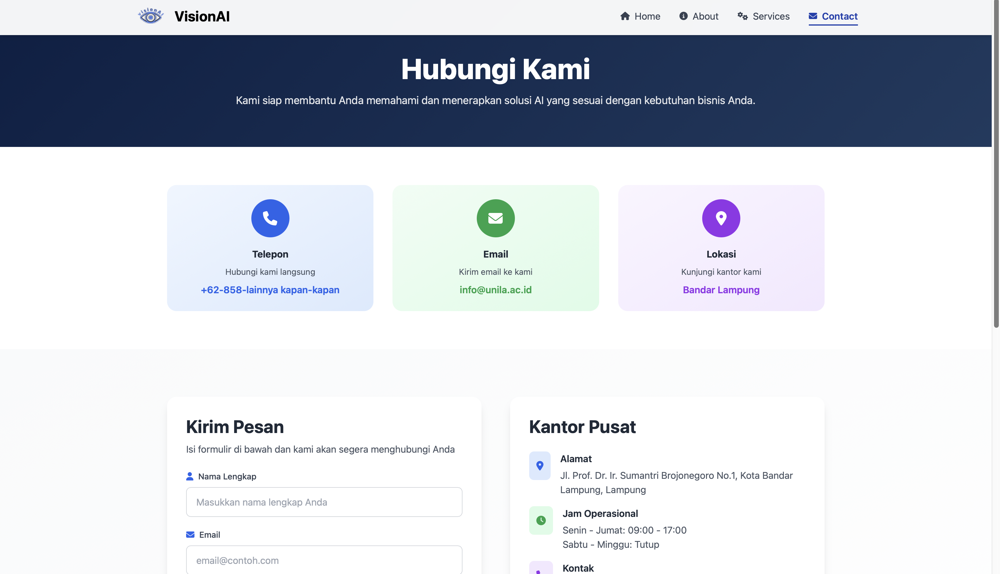

# 🌐 Praktikum Pemrograman Web  

Repositori ini berisi kumpulan tugas, laporan, dan proyek praktikum mata kuliah **Pemrograman Web**.  
Setiap folder mewakili modul atau tugas tertentu yang dikerjakan selama semester berjalan.

---

## 📁 Struktur Folder
``` 
PraktikumPemWeb/
├── TA_Modul 1/
│   ├── index.html
│   ├── style.css
│   └── Screenshot Tampilan
├── TA_Modul 2/
│   ├── index.html
│   ├── style.css
│   ├── Screenshot Tampilan
│   └── README.md
├── TA_Modul 3/
│   ├── index.html
│   ├── pages/
│   │   ├── about.html
│   │   ├── layanan.html
│   │   └── contact.html
│   ├── assets/
│   │   ├── logo/
│   │   └── images/
│   ├── css/ 
│   │   └── index.css
│   ├── js/ 
│   │   └── index.js
│   └── README.md
└── README.md
```


---

## 🧠 Deskripsi Singkat: TA_Modul 3  

**Judul Modul:** Pembuatan Landing Page Multi-Halaman (Startup VisionAI)  
**Tujuan:**  
Mengimplementasikan struktur HTML, styling dengan framework **Tailwind CSS**, serta konsep navigasi antar halaman (multi-page) untuk membangun landing page profesional yang modern dan responsif.

### 🎯 Mahasiswa diharapkan mampu:
- Membuat **landing page responsif** dengan beberapa laman seperti *Home*, *About*, *Services, dan *Contact*.  
- Menerapkan **komponen interaktif** seperti navbar dinamis, animasi background, dan tombol navigasi.  
- Menyusun struktur folder proyek secara **terorganisir** dengan pemisahan antara HTML, CSS, JS, dan aset.  
- Melakukan **deploy website** ke GitHub Pages.  

---

## 🧩 Teknologi yang Digunakan
- ⚙️ **HTML5**  
- 🎨 **Tailwind CSS**  
- 🧭 **JavaScript (interaktif & animasi)**  
- 💎 **Font Awesome (ikon)**  
- 🐙 **Git & GitHub Pages (deployment)**  

---

## 🚀 Output

Website landing page startup **VisionAI** dengan 4 laman utama:  

| 🌐 Laman | 🧾 Deskripsi |
|----------|--------------|
| **Home** | Tampilan utama berisi hero section dan CTA. |
| **About** | Profil perusahaan VisionAI dan tim pengembang. |
| **Layanan** | Daftar produk dan layanan berbasis kecerdasan buatan. |
| **Contact** | Formulir kontak dan informasi media sosial. |

### ✨ Fitur Utama:
- Navbar responsif dengan dropdown untuk tampilan mobile.  
- Animasi background hero yang halus.  
- Transisi antar halaman yang lembut dan konsisten.  
- Desain minimalis dengan warna khas VisionAI.  

---

## ⚙️ Cara Menjalankan  

### 1️⃣ Clone repositori ini:
```bash
git clone https://github.com/HibbanRdn/PraktikumPemWeb.git
```

### 2️⃣ Masuk ke folder proyek modul 3:
```bash
cd PraktikumPemWeb/TA_Modul\ 3
```
### 3️⃣ Jalankan di browser:
- Buka file index.html secara langsung, atau
- Gunakan ekstensi Live Server di Visual Studio Code.

---

## 🌍 Demo / Deploy GitHub Pages  
Kunjungi hasil akhirnya di sini:  
👉 [VisionAI Landing Page - GitHub Pages](https://hibbanrdn.github.io/LandingPage/)

---

## 📸 Preview Tampilan Website

### 🏠 Halaman Home
<p align="center">  </p>

### 👥 Halaman About
<p align="center">  </p>

### ⚙️ Halaman Services
<p align="center">  </p>

### 📞 Halaman Contact
<p align="center">  </p>

---

## 👨‍💻 Dibuat Oleh
- Nama: Muhamad Hibban Ramadhan
- NPM: 2315061094
- Program Studi: Teknik Informatika
- Kelas: PPW-E
- Mata Kuliah: Praktikum Pemrograman Web
