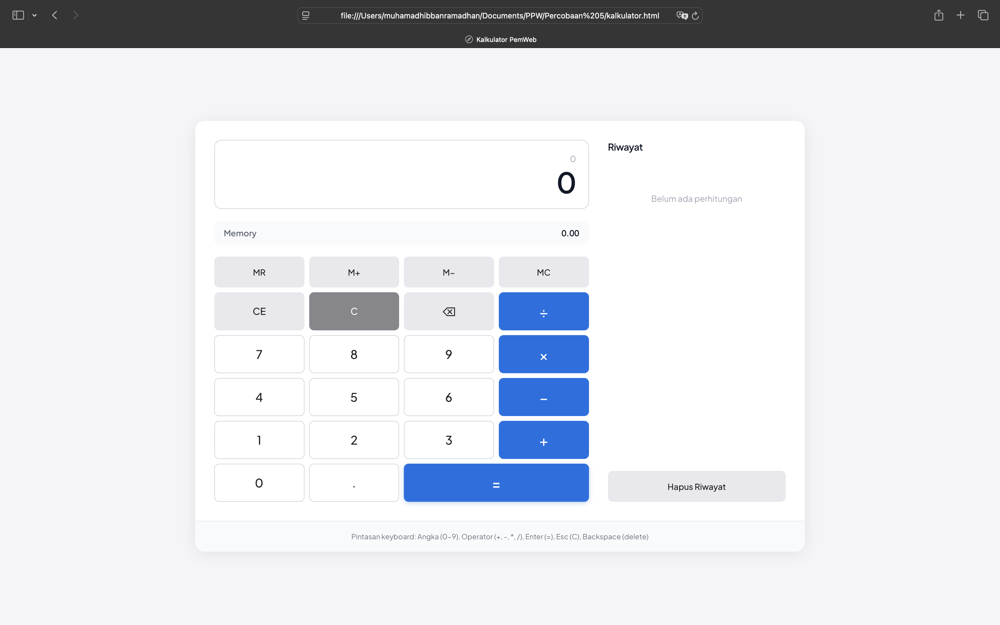
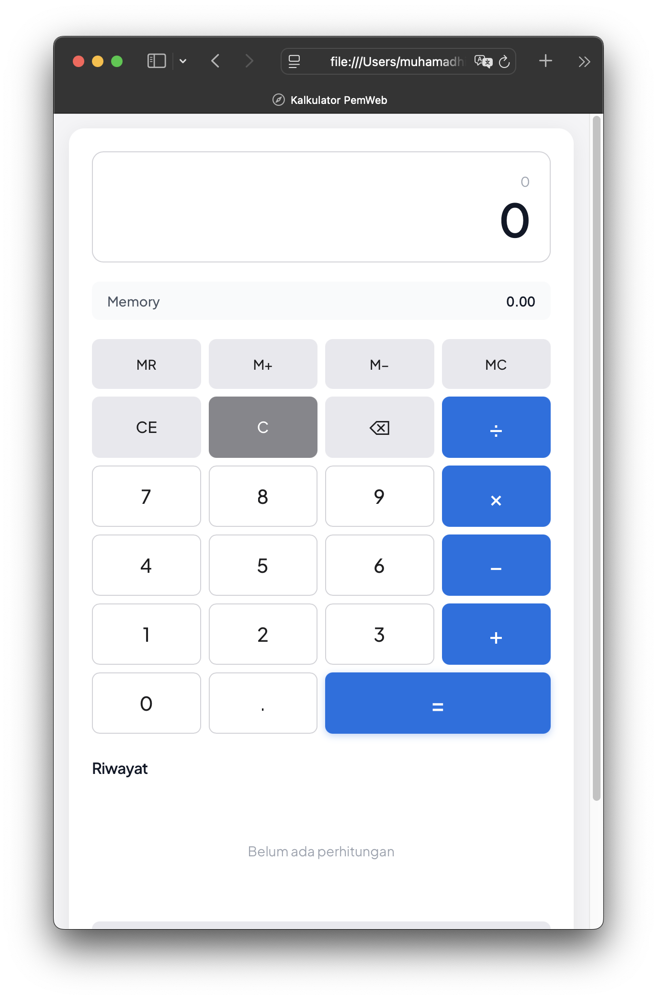

# 🌐 Praktikum Pemrograman Web

Repositori ini berisi kumpulan tugas, laporan, dan proyek praktikum mata kuliah **Pemrograman Web**.
Setiap folder mewakili modul atau tugas tertentu yang dikerjakan selama semester berjalan.

---

## 📁 Struktur Folder

```bash
TA_Modul 5/
├── index.html
├── assets/
│   ├── css/
│   │   └── style.css
│   └── js/
│       └── script.js
├── docs/
│   ├── desktop.png
│   └── mobile.png
└── README.md
```

---

## 🧠 Deskripsi Singkat: TA_Modul 5

**Judul Modul:** JavaScript Dasar
**Tujuan:**
Mengimplementasikan konsep fundamental JavaScript—mulai dari variabel, fungsi, event listener, hingga manipulasi DOM—untuk membangun **kalkulator web interaktif** yang responsif dan mudah digunakan.

### 🎯 Mahasiswa diharapkan mampu:

* Menghubungkan JavaScript dengan HTML melalui **DOM Manipulation**.
* Menggunakan **event listener** seperti `click`, `keydown`, dan `input`.
* Mengelola logika kalkulasi menggunakan fungsi terstruktur.
* Membuat antarmuka kalkulator yang responsif untuk **desktop & mobile**.
* Menyusun struktur folder proyek secara **rapi dan modular** (HTML, CSS, JS, dokumentasi).

---

## 🧩 Teknologi yang Digunakan

* ⚙️ **HTML5**
* 🎨 **CSS3 (Custom Styling)**
* 🧠 **JavaScript DOM & Event Handling**
* 🍃 **Tailwind CSS CDN**
* 🐙 **Git & GitHub (version control)**

---

## 🚀 Output

Aplikasi **Kalkulator Web Interaktif** dengan fitur utama berikut:

| 🔢 Fitur               | 🧾 Deskripsi                                                             |
| ---------------------- | ------------------------------------------------------------------------ |
| **Operasi Dasar**      | Tambah, kurang, kali, bagi.                                              |
| **Clear & Backspace**  | Menghapus input sepenuhnya atau satu per satu.                           |
| **Keyboard Support**   | Input lewat keyboard: angka, operator, Enter (=), Escape (C), Backspace. |
| **Tampilan Responsif** | Beradaptasi secara otomatis untuk tampilan mobile dan desktop.           |
| **Validasi Input**     | Cegah error seperti operator ganda dan pembagian 0.                      |

### ✨ Fitur Tambahan:

* Efek hover & active untuk tombol.
* Animasi ringan pada input display.
* Layout tombol yang rapih dan konsisten pada semua ukuran layar.

---

## ⚙️ Cara Menjalankan

### 1️⃣ Clone repositori:

```bash
git clone https://github.com/HibbanRdn/PraktikumPemWeb.git
```

### 2️⃣ Masuk ke folder modul 5:

```bash
cd PraktikumPemWeb/TA_Modul\ 5
```

### 3️⃣ Jalankan di browser:

* Buka file `kalkulator.html` langsung, atau
* Jalankan dengan ekstensi **Live Server** pada Visual Studio Code.

---

## 📸 Preview Tampilan Kalkulator

### 🖥️ Tampilan Desktop

<p align="center">  </p>

### 📱 Tampilan Mobile

<p align="center">  </p>

---

## 👨‍💻 Dibuat Oleh

* Nama: **Muhamad Hibban Ramadhan**
* NPM: **2315061094**
* Program Studi: **Teknik Informatika**
* Kelas: **PPW-E**
* Mata Kuliah: **Praktikum Pemrograman Web**
