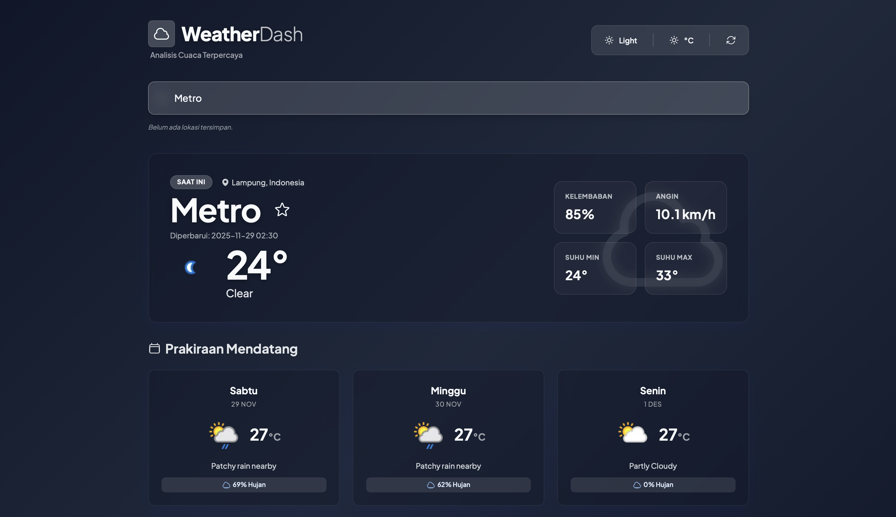

# 🌤️ Dashboard Cuaca & AJAX – Tugas Akhir Praktikum Pemrograman Web

Repositori ini berisi kumpulan tugas, laporan, dan proyek praktikum mata kuliah **Pemrograman Web**.  
Setiap folder mewakili modul atau tugas tertentu yang dikerjakan selama semester berjalan.

---

## 📁 Struktur Folder

```bash
TA_Modul 6/
├── index.html
├── LICENSE
├── .gitignore
├── api/
│   ├── .env (perlu dibuat manual)
│   └── api.php
├── assets/
│   ├── css/
│   │   └── style.css
│   └── js/
│       └── script.js
└── README.md
````

-----

## 🧠 Deskripsi Singkat: TA\_Modul 6

**Judul Modul:** AJAX dan Web Service (PHP Backend Proxy)  
**Tujuan:** Membangun aplikasi **Dashboard Cuaca** yang memanfaatkan teknologi **AJAX (Asynchronous JavaScript and XML)** untuk mengambil data secara *real-time* dari layanan pihak ketiga (WeatherAPI), dengan menggunakan PHP sebagai perantara (*proxy*) untuk mengamankan API Key.

### 🎯 Mahasiswa diharapkan mampu:

  * Menerapkan konsep **AJAX / Fetch API** untuk komunikasi data tanpa reload halaman.
  * Membuat **Backend Proxy** sederhana menggunakan PHP untuk menyembunyikan kredensial (API Key).
  * Memanipulasi DOM secara dinamis berdasarkan data JSON yang diterima dari server.

-----

## 🧩 Teknologi yang Digunakan

  * ⚙️ **HTML5**
  * 🎨 **CSS3** (Custom Glassmorphism & Animations)
  * 🍃 **Tailwind CSS** (Utility-first Framework)
  * 🧠 **JavaScript** (Fetch API, Geolocation, DOM)
  * 🐘 **PHP** (Server-side Logic & cURL Request)
  * ☁️ **WeatherAPI.com** (Penyedia Data Cuaca)
  * ▲ **Vercel** (Deployment Hosting)

-----

## 🚀 Output

Aplikasi **Weather Dashboard - Enterprise Edition** dengan fitur utama berikut:

| 🔢 Fitur | 🧾 Deskripsi |
| :--- | :--- |
| **Pencarian Kota** | Autocomplete pencarian kota di seluruh dunia. |
| **Cuaca Real-time** | Menampilkan suhu, kelembaban, kecepatan angin, dan kondisi cuaca saat ini. |
| **Prakiraan Cuaca** | Prediksi cuaca untuk beberapa hari ke depan (Forecast). |
| **Deteksi Lokasi** | Menggunakan Geolocation API untuk mendeteksi cuaca di lokasi pengguna otomatis. |
| **Favorit (Session)** | Menyimpan daftar kota favorit menggunakan PHP Session. |

### ✨ Fitur Tambahan:

  * **Dark Mode & Light Mode**: Tema tampilan yang dapat diganti sesuai preferensi pengguna.
  * **Unit Conversion**: Pilihan satuan suhu antara Celcius (°C) dan Fahrenheit (°F).
  * **Glassmorphism UI**: Desain antarmuka transparan yang modern dan estetis.

-----

## 🌍 Deployment di Vercel

Aplikasi ini telah di-deploy dan dapat diakses secara langsung melalui:

👉 **[Buka Weather Dashboard](https://weather-dash-sand.vercel.app/)**

-----

## ⚙️ Cara Menjalankan (Lokal)

⚠️ **PENTING:** Karena modul ini menggunakan PHP, aplikasi membutuhkan Web Server lokal (seperti XAMPP, MAMP, atau Laragon) atau runtime PHP.

### 1️⃣ Clone & Pindahkan Folder:

Clone repositori, lalu pindahkan folder `TA_Modul-6` ke dalam direktori root server lokal Anda (misalnya: `htdocs` pada XAMPP).

```bash
git clone [https://github.com/HibbanRdn/PraktikumPemWeb.git](https://github.com/HibbanRdn/PraktikumPemWeb.git)
# Pindahkan folder ke c:/xampp/htdocs/
```

### 2️⃣ Konfigurasi API Key (.env):

Buat file baru bernama `.env` di dalam folder `api/` dan masukkan API Key dari WeatherAPI.com:
*(Lihat file `api.php` baris 33 untuk referensi logika env)*

```env
WEATHER_API_KEY=masukkan_api_key_anda_disini
```

### 3️⃣ Jalankan di Browser:

Buka browser dan akses melalui localhost:
`http://localhost/PraktikumPemWeb/TA_Modul-6/index.html`

-----

## 📸 Preview Tampilan Dashboard

### 🖥️ Tampilan Utama (Light Mode)

<p align="center">  </p>

### 🌙 Tampilan Dark Mode

<p align="center">  </p>

-----

## 👨‍💻 Dibuat Oleh

  * Nama: **Muhamad Hibban Ramadhan**
  * NPM: **2315061094**
  * Program Studi: **Teknik Informatika**
  * Kelas: **PPW-E**
  * Mata Kuliah: **Praktikum Pemrograman Web**

<!-- end list -->
